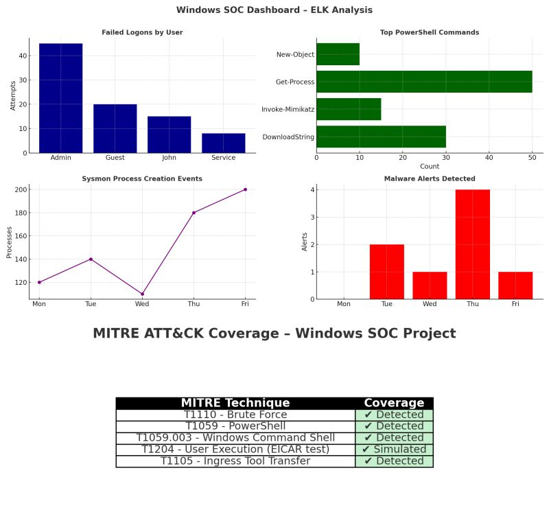

# Windows SOC Monitoring & Threat Hunting Lab — ELK Stack

A Windows-focused SOC monitoring and detection engineering lab built with:

- **Elasticsearch**
- **Kibana**
- **Elastic Agent**
- **Sysmon**
- **Elastic Endpoint Security**

Build notes, configuration, and detection work from a homelab I ran to learn
Windows telemetry pipelines and detection engineering end to end.

---

## Key features

- Integrated ingestion of Windows Event Logs, Sysmon logs, PowerShell logs, and
  Endpoint Security alerts
- Dashboards tracking:
  - Failed logons
  - Suspicious PowerShell
  - Sysmon process activity
  - Malware alerts
- Custom detection rules with MITRE ATT&CK mapping



---

## Techniques simulated

| ATT&CK ID | Technique | Signal |
|---|---|---|
| T1110 | Brute Force | Event ID 4625 spikes |
| T1059 | Command and Scripting Interpreter | PowerShell execution / encoded commands |
| T1059.003 | Windows Command Shell | `cmd.exe` execution |
| T1204 | User Execution | EICAR test file |
| T1105 | Ingress Tool Transfer | Outbound file transfer |

---

## Dashboard

Contains:

- Failed logons
- PowerShell command usage
- Sysmon process trends
- Malware alerts
- MITRE ATT&CK coverage table

---

## What I learned

- Building full Windows telemetry pipelines
- Using Kibana Lens, Timelines, and Detection Rules
- Threat hunting with Sysmon process chains
- IR workflow: detect → triage → analyse → contain → remediate

---

## Repo structure

```
windows-elk-soc-lab/
├── README.md
├── screenshots/
│   └── overview.jpg
└── docs/
    ├── methodology.md
    ├── attack-scenarios.md
    └── queries.spl
```

---

## Scope

Single Windows endpoint lab. Detections here are tuned against one machine's
baseline and would need rework against enterprise log volume.

© 2025 Chirayu Paliwal
